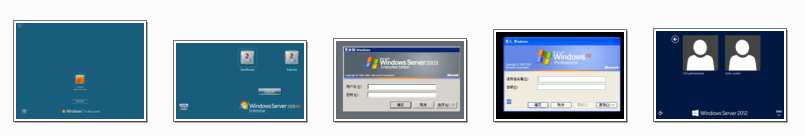
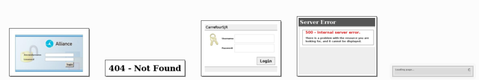
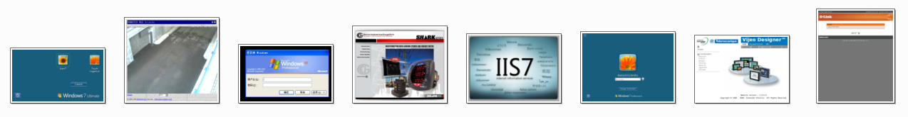
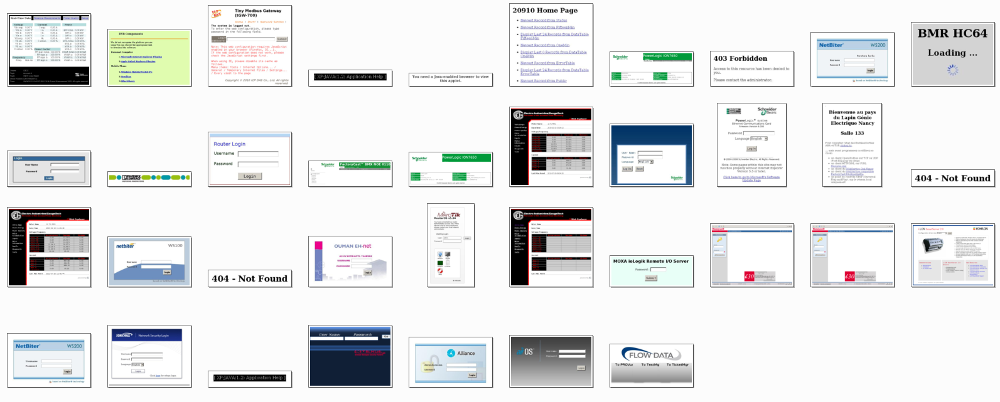
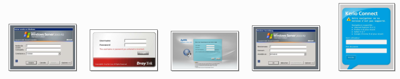
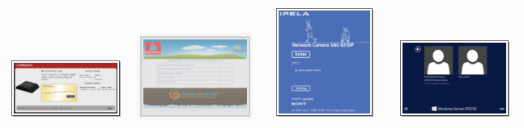
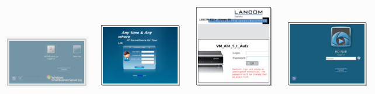
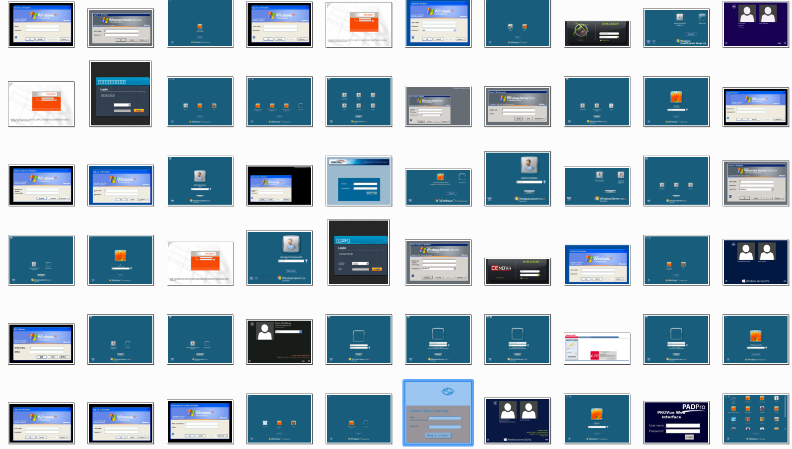
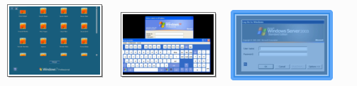

Objective
=========

In the article [Scanning Internet-exposed Modbus devices for fun & fun](http://pierre.droids-corp.org/blog/html/2015/02/24/scanning_internet_exposed_modbus_devices_for_fun___fun.html),
the author had scan the whole Internet, looking for Modbus device on the 502 TCP port.

When available, it also included screenshots. For more detail about them, take a look at [IVRE: screenshot all the things!](http://pierre.droids-corp.org/blog/html/2016/10/25/ivre_screenshot_all_the_things.html).

In this example, I will use QuickLabel to quickly extract screenshots looking like Windows login form (there is about ~6000 screenshots in the dataset).

Preparing the dataset
=====================

Following the instruction on the blog post, I imported the result in a local [IVRE](https://github.com/cea-sec/ivre) instance.
Then, using the Python API:

```Python
import os
from ivre.utils import int2ip
from ivre.db import db

outdir = "screenshots"
for host in db.nmap.get(db.nmap.searchscreenshot()):
    for port in host["ports"]:
        if "screendata" in port:
            data = port["screendata"]
            ipaddr = int2ip(host["addr"])
            open(os.path.join(outdir, "%s_%d.jpg" % (ipaddr, port["port"])), "w").write(data)
```

Now, the screenshots are in a `screenshots` directory, with an unique name.

Initialization
==============

We first create the working directory `temporary`:

```sh
mkdir temporary
ln -s {path-to-dataset} temporary/dataset
```

As we want to extract Windows login forms, we will create 2 labels:
* `windows`: where wanted screenshots go
* `not_windows`: for all others

```sh
mkdir temporary/windows
mkdir temporary/not_windows
```

We now populate them with a few screenshots.

* *Windows*

* *Not Windows*


Iterations
==========

Let's launch QuickLabel on our working directory.

```
$ python classify_screens.py temporary/
Using TensorFlow backend.
Load model's weights
Welcome. Type 'step' to move a step forward
(Cmd) options
Current options:
	suffix              	_potential           append to candidate labels (default is '_potential')
	new_sample          	50                   number of new samples to proceed per step (default is '50')
	needhelp            	needhelp             directory for unsure candidate (default is 'needhelp')
	model               	ResNet50             model to use for feature generation (default is 'ResNet50')
	needhelp_prob       	0.6                  probability threshold for 'needhelp' choice (default is '0.6')
	classifier          	RandomForest         classifier to use feature classification (default is 'RandomForest')
	force_diversity     	True                 force at least one 'needhelp' or all category on step (default is 'True')
	dataset             	dataset              dataset source (default is 'dataset')
Use options <name> <value> to set an option
```

Here, we will use the default options. So, we run our first step.

```
(Cmd) step
Clean the directory
Labels:
	windows:	5
	not_windows:	5
Learn on labelled elements
Look for new elements
```

We obtain the following results:

* *Windows*

* *Not Windows*

* *Need help*


Note how the classifier is asking help on login forms (through the `needhelp` directory). Should it keep only Windows login form or all of them?

We then move image to their correct classes, so for the next step, we have:
```
Labels:
	windows:	10
	not_windows:	13
```

There is still a few mistake, but there is no screenshots looking like Windows login form in *Not Windows*.
The `needhelp` directory contains:



Again, we move elements to their correct category, and we continue to the next step.

```
Labels:
	windows:	11
	not_windows:	16
```

The `needhelp` directory contains:



Note the interrogation on the unknown avatar login picture (top right).

After running the next step, the Windows login forms are only present in our *windows* category (neither in *Not Windows* nor in *Needhelp*).
It seems that we reached a point where our classifier starts to work as expected.

We can then "generalize" to the entire dataset.

```
(Cmd) generalize
Apply on the full dataset
```

Results
=======

3 iterations were needed, and around 1 minute of user attention.

The rest of the time (4 minutes on my laptop) is spent on computing the features,
which is cachable (we could have run a full feature extraction in background before starting the labellisation) and could have been run on GPU. 

I didn't manually labelize all images from the dataset for verification, so here is a partial result.

Label | Correct | Wrong | Total
----- | ------- | ----- | ------
Not windows | 3 | 702 | 705
Windows | 52 | 13 | 65

The *Windows* category:



Looking at errors in this category, we observe a few family of similar login form which are improperly labeled.
Moving them to the correct category and relaunching the generalization step should correct it.

The error in the *Not Windows* category are:



Note the corner case of the virtual keyboard, a never seen before (for the classifier) sample, with an obstructed login form.

Final words
===========

In just a few minutes, starting from scratch, we've been able to obtain a correct extraction of Windows login form from a Modbus Screenshot dataset.
Now that we have more labelised sample, we can refine our classification using fine-tunning, other model or classifier, varying the thresholds (quite permissive by default), ...

Note that the shape of these screenshots varies widely. While QuickLabel is resizing them to the expected model input shape, splitting the image in batch would probably works better.
Indeed, if the "resolution" can be preserved, the patterns used for classification will be relevant in each screenshot (for instance, the Windows logo).
